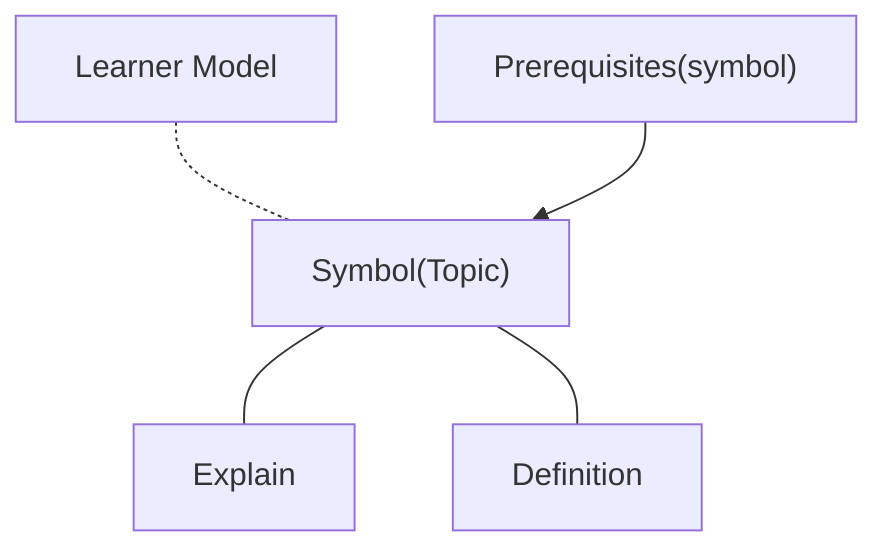
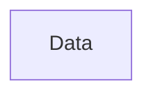
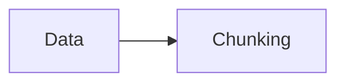
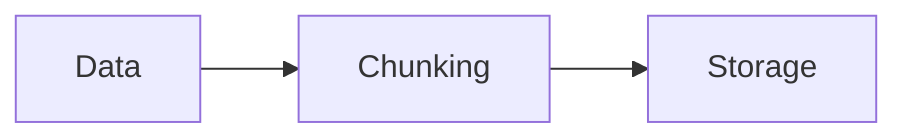
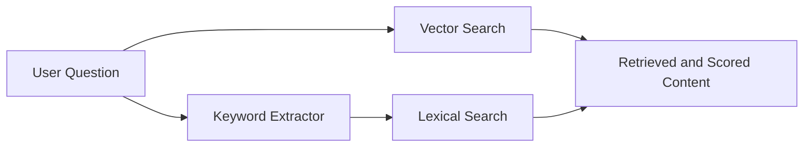
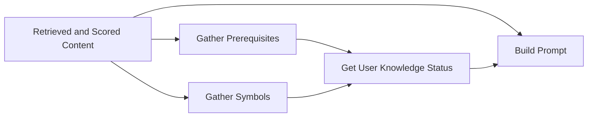

# TripartiteRAG

## Problem Statement & Motivation
Students often ask questions from ChatGPT or other language models.
::left::
<v-click>

### 🎓 Challenge in Using Language Models for Education
</v-click>
<v-click>
these models do not know:
</v-click>
<v-clicks >

- The student’s background knowledge.
- The prerequisite topics they should already understand.
- What the instructor has covered in class.
</v-clicks>
::right::
<v-click at=1>

</v-click>
---
layout: two-cols-header
---

### ⚠️ Resulting Issues
::left::
<v-clicks >

- Answers may include inaccuracies.
- Some explanations may be irrelevant or missing.
- The model may ignore details the instructor has already explained.
- Responses can sometimes contain hallucinations.
</v-clicks>
::right::
<v-click>

</v-click>
---

### 🎯 Thesis Goal

My thesis aims to address and solve these limitations by designing a system that:

<v-clicks>

- Adapts responses to the student’s knowledge level.
- Incorporates course‑specific content.
- Reduces hallucinations.
- Provides more accurate, context‑aware answers.
</v-clicks>
---
layout: two-cols-header
---

### Data Structure

::left::

::right::

- All symbols stored on a knowledge graph.
- A learner model is a separate system that predicts a student’s level of understanding based on their interactions with quizzes and problem‑solving tasks.
- All symbols and their relationships are stored in GraphDB, and data retrieval is possible only via SPARQL queries.
- You can see all system on [ALeA system](https://alea.education/).
---

## ✅ What I done so far! 

### Indexing
<v-switch>
<template  #1>

#### Data
- The course materials and content related to each section and the UUID.
</template >

<template #2>

</template>
<template #3>

</template>
</v-switch>

---

### Generating
<v-click>

</v-click>

<v-click>

***

</v-click>

---

## Remaining Tasks

<v-clicks depth=2>

- Evaluating my results.
    - Human review: instructor/TA rubric
    - LLM as judge: does the answer align with retrieved fragments?
- Try RAFT method
    - Prepare a small dataset with question and answers.
    - Fine-Tuning the model.
    - compare RAG results with new Results.
</v-clicks>