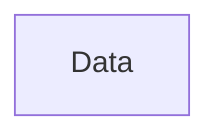
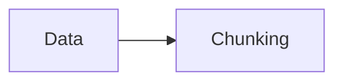
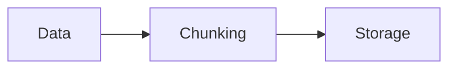
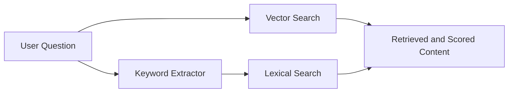

# TripartiteRAG

## Problem Statement & Motivation
Students often ask questions from ChatGPT or other language models.
::left::
<v-click>

### 🎓 Challenge in Using Language Models for Education
</v-click>
<v-click>
these models do not know:
</v-click>
<v-clicks >

- The student’s background knowledge
- The prerequisite topics they should already understand
- What the instructor has covered in class
</v-clicks>
::right::
<v-click>

### ⚠️ Resulting Issues
</v-click>
<v-clicks >

- Answers may include inaccuracies
- Some explanations may be irrelevant or missing
- The model may ignore details the instructor has already explained
- Responses can sometimes contain hallucinations
</v-clicks>
---

### 🎯 Thesis Goal

My thesis aims to address and solve these limitations by designing a system that:

<v-clicks>

- Adapts responses to the student’s knowledge level
- Incorporates course‑specific content
- Reduces hallucinations
- Provides more accurate, context‑aware answers
</v-clicks>
---

### Data Structure

---

## ✅ What I done so far! 

### Indexing
<v-switch>
<template  #1>

#### Data
- The course materials and content related to each section and the UUID.
</template >

<template #2>

</template>
<template #3>

</template>
</v-switch>

---

### Generating
<v-click>

</v-click>

<v-click>

***

</v-click>